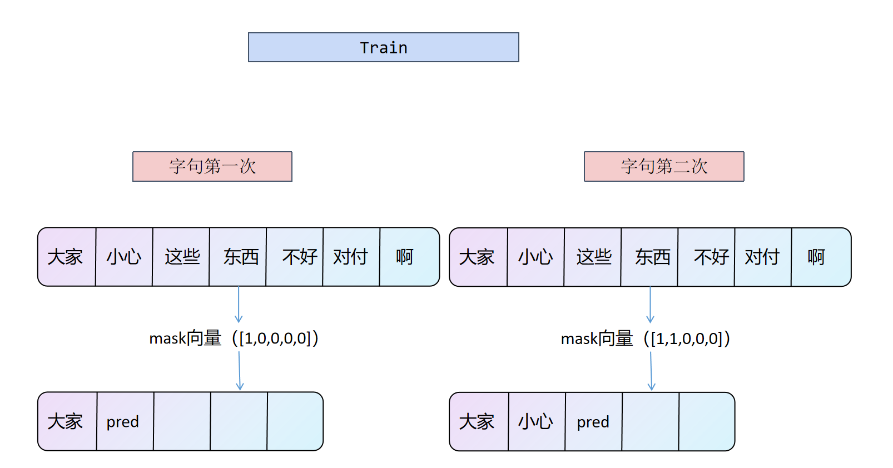

<script type="text/javascript" async src="https://cdnjs.cloudflare.com/ajax/libs/mathjax/2.7.9/MathJax.js?config=TeX-AMS_HTML"></script>
# linerhomework

在了解了国内外研究现状和语言建模（LM）方法之后, 我们进行具体的实验,
即基于 pytorch 的线性回归的模型，实现 LM 任务，并详细评测其性能，分析模型
的效果。

## 实验目的
了解线性回归方法，了解 LM 任务的具体过程，希望能进行完整的训练和评
测，使用多种评测方法测评模型，思考改进的方法

## 方法选择
线性回归输出是一个连续值，因此适用于回归问题。回归问题在实际中很常见，如预测房屋价格、气温、销售额等连续值的问题。LM就是一个自回归的任务。所以理论上线性回归任务是可以完成LM任务的


给定一个无监督的标记语料库 U = {u1, . . . , un}，我们使用标准语言建模目标来最大化以下可能性：
$$L_{1}(\mathcal{U})=\sum \log P\left(u_{i} \mid u_{i-k}, \ldots, u_{i-1} ; \Theta\right)$$

## 数据集

选择的数据集是网上下载的小说txt文件，天龙八部.txt，已经将清洗之后的数据存放在下列路径中，同时还有未清洗的数据
``` c
data/数据.txt
```
您可以通过下面的代码训练自己的sentencepiece模型,通过修改vocab_size和文件路径来训练更大的模型，`这里提供了基础的模型work1.model，您可以在LM.ipynb文件中直接使用`
```python
# 用您的文本文件路径替换以下路径
input_file = "data/数据.txt"
model_prefix = "bpe_model"
vocab_size = 8000

# 训练sentencepiece模型

spm.SentencePieceTrainer.Train(input='data/数据.txt', model_prefix='m', model_type="bpe", vocab_size=vocab_size)
```
## 数据预处理

  
 1.  清洗文本中不需要的token，比如感叹号书名号等，清除除了中文之外的文字
 2.  将文本切分为句子列表，LM的输入方法需要是每个句子单独为一行
 3.  对每个句子分词，sentencepiece训练时使用已经分好词的句子效果会更好

 

 
## 模型构建
1. 定义回归模型，向其中添加线性层和词向量的嵌入层
2. 定义优化函数optim.SGD(model.parameters(), lr=0.001)，学习率为0.001
3. 定义超参数，比如topk的值，滑动窗口inputdim的大小，sentencepiece训练的词表大小，embeding矩阵的大小等等


## 训练过程
1. 确定滑动窗口的大小 inputdim 和最大句子长度 maxsentence，对所有句子
进行处理，如果句子长度超过 maxsentence 就截断之后的 tokens，如果小于
maxsentence 就在补上缺失长度的 pading，填充为 0
2. 对每个句子使用滑动窗口进行滑动，选择该句子中的某个字句，进行 epochs
次训练，然后将窗口移动一步，一步的步长为当前字句的第一个 token 的长
度，重复此过程直到句子结束，进入下一个句子。
3. 在每一次进行概率预测的时候，对最后的输出层进行排序，然后取 topk 个
最大概率的词语 token id，然后根据这 k 个概率分布随机选择一个 token 作
为预测值。



## 结果分析

<table class="tg">
<thead>
  <tr>
    <th class="tg-0pky">评价指标</th>
    <th class="tg-0pky">WER</th>
    <th class="tg-0pky">accurary</th>
    <th class="tg-0pky">bleu</th>
    <th class="tg-0pky">rouge1</th>
    <th class="tg-0pky">rouge2</th>
    <th class="tg-0pky">rougeL</th>
  </tr>
</thead>
<tbody>
  <tr>
    <td class="tg-0pky">base</td>
    <td class="tg-0pky">1.88</td>
    <td class="tg-fymr">0.248</td>
    <td class="tg-0pky">0</td>
    <td class="tg-0pky">0.135</td>
    <td class="tg-0pky">0.0002</td>
    <td class="tg-0pky">0.135</td>
  </tr>
  <tr>
    <td class="tg-0pky">large</td>
    <td class="tg-fymr">1.75</td>
    <td class="tg-0pky">0.225</td>
    <td class="tg-0pky">0</td>
    <td class="tg-fymr">0.146</td>
    <td class="tg-fymr">0.001</td>
    <td class="tg-fymr">0.146</td>
  </tr>
</tbody>
</table>
在表4.1中，我们尝试了两种模型，base和large，其区别主要在他们的训练集大小上，他们的测试集都是天龙八部小说的30\%的文本内容，`base模型的训练集是天龙八部的另外70\%文本内容，large在此基础之上使用了网上提供的中文预训练数据集，大小约为50000token，与原本训练集大小类似，同时为了配合增加的训练集数量，lagre模型还将vacobsize从base的8000扩展到了12000。`表4.1展示的是两个模型在训练集上以0.001的学习率，对每个句子训练一次后得到的评测效果.